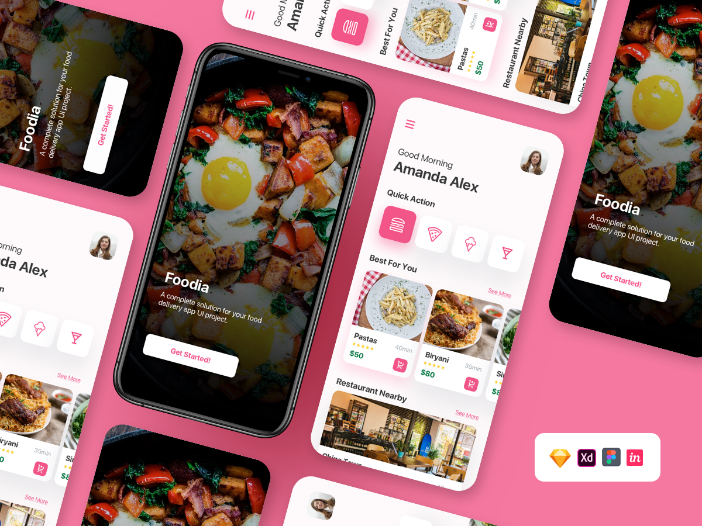
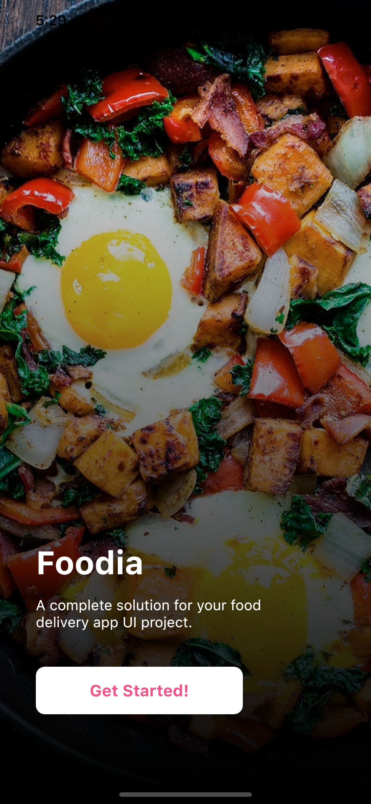
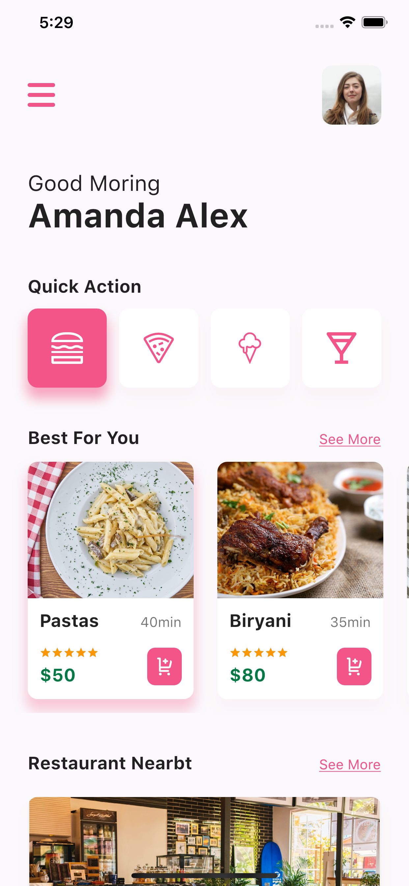

# Flutter UI - Food

[English](README.md)------中文

### 介绍

一共有两个页面，分别为 Splash 和 Home 页面。Splash 页面主要为一段介绍和一个进入按钮，Home 页面主要分为：菜单、信息、分类、最喜欢以及周边餐馆，喜欢模块和附近餐馆包含评分和价格以及到达时间等。

### 视频

YouTube : [观看地址](https://youtu.be/4NfrVsVUjdg)

哔哩哔哩 : [观看地址](https://www.bilibili.com/video/BV1ot4y1C7Ef)

### 设计 

 - 设计者:  Fire UI  [地址](https://www.uplabs.com/posts/free-food-delivery-app)  

### Food 设计稿

### Food 最终完成

   

